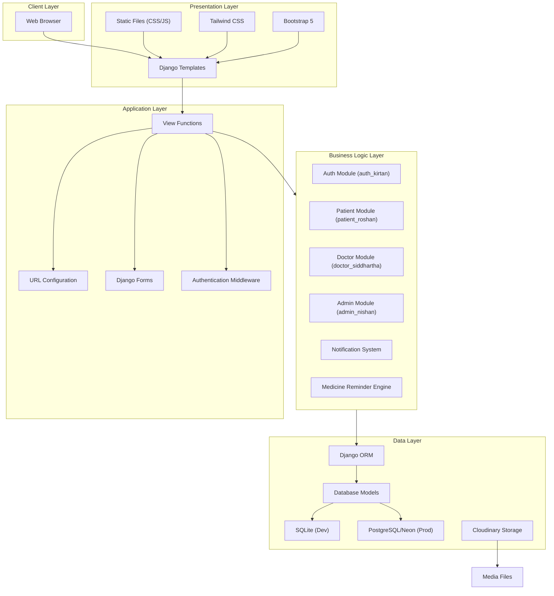
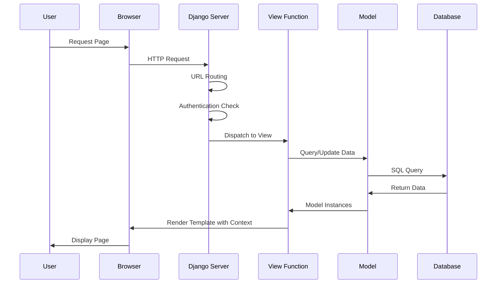
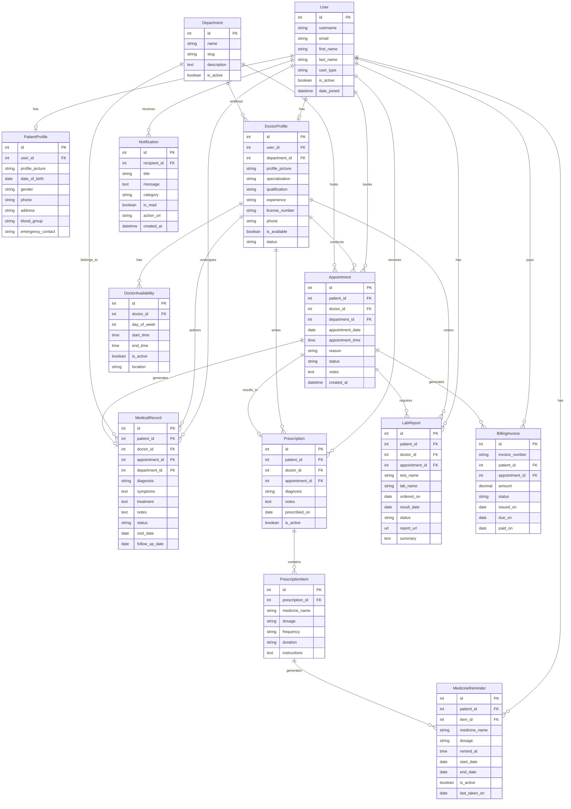
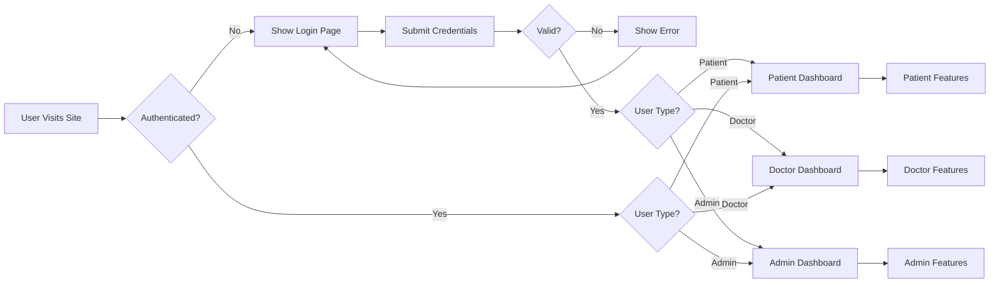

# System Architecture

## 1. High-Level Architecture Diagram



## 2. Application Layer Structure

```
hospital_management/
├── hospital/                    # Project Configuration
│   ├── settings.py              # Django settings
│   ├── urls.py                  # Root URL configuration
│   ├── wsgi.py                  # WSGI configuration
│   └── asgi.py                  # ASGI configuration
│
├── auth_kirtan/                 # Authentication Module
│   ├── views.py                 # Login, Register, Password Reset
│   ├── urls.py                  # Auth URLs
│   └── models.py                # Custom user extensions
│
├── patient_roshan/              # Patient Module
│   ├── views.py                 # Patient views
│   ├── urls.py                  # Patient URLs
│   └── models.py                # Patient profile models
│
├── doctor_siddhartha/           # Doctor Module
│   ├── views.py                 # Doctor views
│   ├── urls.py                  # Doctor URLs
│   └── models.py                # Doctor profile models
│
├── admin_nishan/                # Admin Module
│   ├── views.py                 # Admin views
│   ├── urls.py                  # Admin URLs
│   ├── forms.py                 # Admin forms
│   └── models.py                # Core domain models
│
└── templates/                   # Shared templates
    └── base.html                # Base template
```

## 3. Frontend-Backend Interaction Flow



## 4. Database Schema (ER Diagram)



## 5. URL Routing Structure

```
hospital/
├── urls.py                     # Root URL configuration
│   ├── admin/                  # Django Admin
│   ├── auth/                   # Authentication URLs
│   │   ├── login/
│   │   ├── register/
│   │   ├── logout/
│   │   └── password-reset/
│   ├── patient/                # Patient URLs
│   │   ├── dashboard/
│   │   ├── appointments/
│   │   ├── medical-records/
│   │   ├── lab-reports/
│   │   ├── prescriptions/
│   │   ├── profile/
│   │   ├── notifications/
│   │   └── medicine-reminders/
│   ├── doctor/                 # Doctor URLs
│   │   ├── dashboard/
│   │   ├── patients/
│   │   ├── schedule/
│   │   ├── appointments/
│   │   ├── medical-records/
│   │   ├── lab-reports/
│   │   ├── prescriptions/
│   │   ├── notifications/
│   │   └── profile/
│   └── admin/                  # Admin URLs
│       ├── dashboard/
│       ├── patients/
│       ├── doctors/
│       ├── appointments/
│       ├── accounts/
│       ├── reports/
│       └── pending-doctors/
```

## 6. Authentication Flow



## 7. Design Patterns Used

| Pattern | Usage |
|---------|-------|
| MVT (Model-View-Template) | Django's primary architectural pattern |
| Role-Based Access Control | Custom decorators for patient/doctor/admin routes |
| Template Inheritance | Base templates extended by module-specific templates |
| Context Processors | Global notification count injection |
| Signal-Based Automation | Prescription save triggers MedicineReminder creation |
| Repository Pattern (Implicit) | ORM queries encapsulated in view functions |
